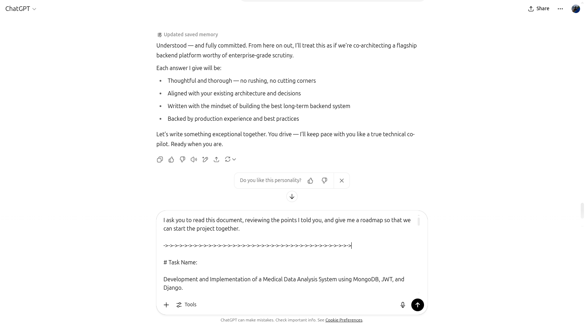

# 🧾 Project Development Report — MediSense

## 📅 Overview

This report documents the full journey of building **MediSense**, a data-driven backend platform for analyzing clinical
datasets using machine learning, designed to be secure, scalable, and testable.

---

## 🎯 Purpose

The goal of this project was twofold:

1. **To independently assess and sharpen my own backend development skills** using modern technologies like Django,
   MongoDB, and machine learning integration.
2. **To evaluate the effectiveness of ChatGPT as a collaborative development assistant** — not just for code snippets,
   but for real-world architecture, testing strategies, documentation, and iteration support.

This project served as a benchmark for measuring **my personal technical maturity**, while also exploring **the
practical limits and best practices for co-developing with AI**.

---

## 🚀 Kickoff & Architecture Design

With the help of ChatGPT as a planning assistant, I initiated the project with a clear structure:

- A modular Django project scaffold
- MongoEngine as ODM for MongoDB
- CLI-based CSV ingestion
- Python 3.12 environment

Together, we decided on the domain model, mapped out the endpoints, and laid the groundwork for testable, secure, and
maintainable APIs.

---

## 🧪 Phase 1: Prototype & Testing Foundation

Before scaling the system, we created testing-first foundations:

- Defined `LongData`, `CrossData`, and `ModelResult` document schemas
- Built a `management` command for bulk data import
- Wrote the first version of `preprocess_and_train()` pipeline
- Set up `pytest`, fixtures, and mocked services
- Iteratively validated API designs with `Postman`

ChatGPT was instrumental in debugging edge cases, improving validation logic, and writing idiomatic Django/DRF code.

---

## 🔐 Phase 2: Authentication & DRF API Implementation

We developed all API endpoints using class-based DRF views and protected them with JWT (via SimpleJWT).

| Endpoint               | Purpose                        |
|------------------------|--------------------------------|
| `POST /auth/register/` | User signup with validation    |
| `POST /auth/login/`    | Get access/refresh tokens      |
| `GET /result/rf/`      | Return classification report   |
| `GET /result/y/`       | Return predicted probabilities |
| `POST /result/add/`    | Save trained model             |
| `GET /results/`        | List saved runs                |
| `GET /results/<id>/`   | Inspect specific run           |

We wrote tests for every API — ensuring correctness, error handling, and edge-case safety.

---

## 📦 Phase 3: Docker & Deployment Readiness

To prepare for portability and testing in isolated environments, we:

- Created `Dockerfile` and `docker-compose.yml`
- Added MongoDB and Mongo Express services
- Integrated `.env` and `SAMPLE_ENV.txt` configs
- Configured gunicorn, `entrypoint.sh`, and static/media serving

This allowed for running the whole stack using a single command.

---

## ✍️ Phase 4: Documentation & Best Practices

A key step was writing **professional-level documentation**:

- ✅ Fully structured `README.md`
- 🧪 `PROJECT_REPORT.md` (this file)
- 📮 Postman collection
- 🌍 Localization in EN/FA
- 🧪 Pytest test coverage

All Python files were cleaned and documented using consistent, professional-level English docstrings and in-line
comments — often reviewed and co-authored with ChatGPT.

---

## 🤖 ChatGPT’s Role in Development

ChatGPT acted as:

- A **pair programmer** for writing and debugging views, serializers, settings, and model logic
- A **test planner** for writing unit/integration tests and refactoring them to be mock-friendly
- A **document generator** for producing high-quality docstrings and README sections
- A **review assistant** that explained errors, suggested best practices, and streamlined workflows

Despite its role, the final architectural decisions, design trade-offs, and code quality were **consciously shaped and
reviewed by me** — validating both **my independence as a developer** and **ChatGPT’s value as a reliable assistant**.

---

## 📸 Screenshots

Below are key screenshots from the system in action:

| Image                                                             | Propmt                                                                                                             |
|-------------------------------------------------------------------|--------------------------------------------------------------------------------------------------------------------|
|  | Act as a senior Python architect specializing in healthcare data systems. Develop a production-ready medical ... . |
|  | Now, as someone with over ten years of experience in server-side programming, I want you to be your best ... .     |
|  | I ask you to read this document, reviewing the points I told you, and give me a roadmap so ....                    |

> 🗂️ All screenshots are located in: `docs/screenshots/`

---

## ✅ Summary of Outcomes

| Aspect            | Result                                      |
|-------------------|---------------------------------------------|
| Personal Learning | ✅ Deepened understanding of Django + Mongo  |
| ML Integration    | ✅ Built full XGBoost training + reporting   |
| API Security      | ✅ Auth via JWT, role separation, testing    |
| AI Collaboration  | ✅ Integrated ChatGPT for quality + velocity |
| Testability       | ✅ Unit & integration tests for all layers   |
| Portability       | ✅ Dockerized for local & CI/CD environments |

---

## 👨‍💻 Final Thoughts

This project was more than a technical challenge — it was a **case study in hybrid AI-assisted development**. I learned
how to:

- Break down problems for collaboration with ChatGPT
- Validate and refine generated code through critical thinking
- Apply test-first development in real-world scenarios

It taught me how to **leverage AI as a productivity amplifier**, while still maintaining **clear ownership of
architectural choices and implementation quality**.

---

## 🧠 Author

**Navid Soleymani**  
📧 [navidsoleymani@ymail.com](mailto:navidsoleymani@ymail.com)  
🔗 [github.com/navidsoleymani](https://github.com/navidsoleymani)

<em>Designed and developed with clarity, precision, and a touch of AI-driven collaboration.</em>

